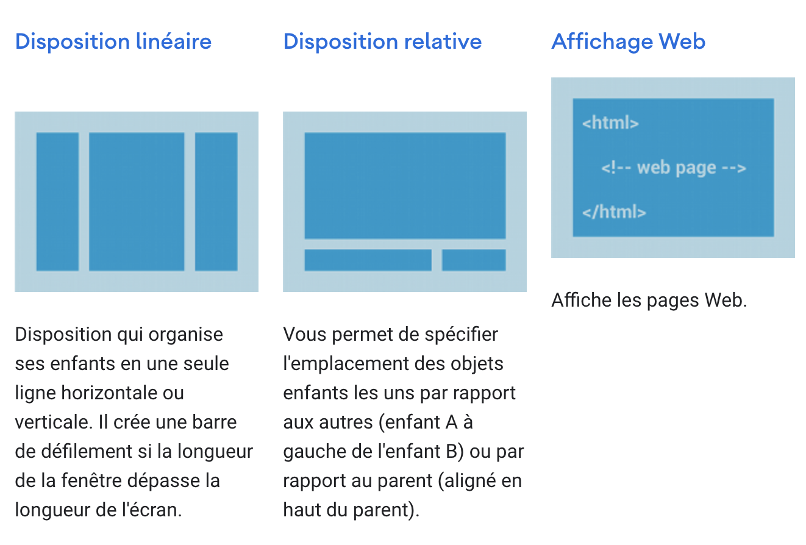
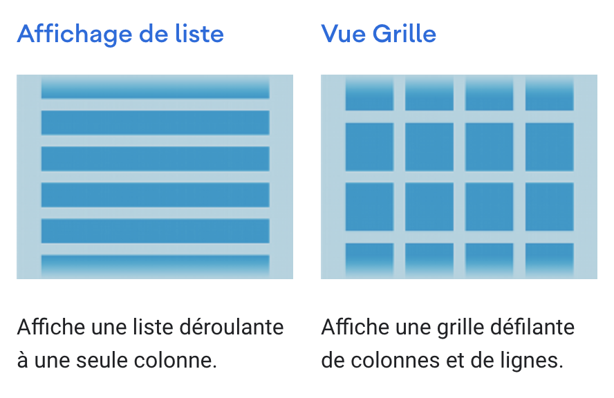

# Containers App

<h4>Hiérarchie des vues ou widgets</h4>

<h5>Exemples de View:</h5>
1. Button  
2. TextView

<h5>Exemples de ViewGroup:</h5>
1. LinearLayout  
2. ConstraintLayout

<h5>Charger une ressource de mise en page par référence dans le code de l'application</h5>
<pre>
public void onCreate(Bundle savedInstanceState) {
    super.onCreate(savedInstanceState);
    setContentView(R.layout.main_layout);
}
</pre>

<h5>Les attributs</h5>
<b>Identifiant</b>

Nouveau nom de ressource

<code>
android:id="@+id/my_button"
</code>

Id de ressource Android

<code>
android:id="@android:id/empty"
</code>

<h5>Créer une instance d'une vue/widget à partir de son identifiant</h5>
<b>onCreate</b>
<pre>
Button myButton = (Button) findViewById(R.id.my_button);
</pre>

<h5>Paramètres de mise page</h5>

<h5>Utiliser les mesures relatives</h5>
1. dp  
2. wrap_content  
3. match_parent  
<b>Éviter les pixels (px)</b>

<h5>Récupérer l'emplacement d'une vue</h5>
1. getLeft()  
2. getTop()  

Ces méthodes renvoient toutes deux l'emplacement de la vue par rapport à son parent. L'unité de position est le <b>pixel</b>.

3. getRight()  
4. getBottom()  

 Ces méthodes renvoient les coordonnées des bords droit et inférieur du rectangle représentant la vue. Par exemple, 
l'appel getRight() est similaire au calcul suivant : getLeft() + getWidth().

<h5>Taille, rembourrage et marges</h5>
<b>Taille de la vue dans son parent</b>  
1. getMeasuredWidth()  
2. getMeasuredHeight()  
<b>Taille réelle de la vue à l'écran</b>  
3. getWidth()  
4. getHeight()  
<b>Rembourrage ou marges intérieures</b>  
5. setPadding(int, int, int, int)  
   1. getPaddingLeft()  
   2. getPaddingTop()  
   3. getPaddingRight()  
   4. getPaddingBottom()
   

<h5>Dispositions communes</h5>

NB: <b>Une hiérarchie de vue large est préférable à une hiérarchie de vue profonde</b>.

<h5>Construire des mises en page avec un adaptateur</h5>

Lorsque le contenu de votre mise en page est dynamique ou non prédéterminé, 
vous pouvez utiliser une mise en page qui sous-classe AdapterView pour remplir 
la mise en page avec des vues lors de l'exécution. Une sous-classe de la 
AdapterView classe utilise un Adapter pour lier des données à sa mise en page. 
Le Adapter se comporte comme un intermédiaire entre la source de données et la AdapterView mise en page : 
le Adapter récupère les données (à partir d'une source telle qu'un tableau ou 
une requête de base de données) et convertit chaque entrée en une vue qui peut être ajoutée à la mise en AdapterView page.

<h5>Remplir une vue d'adapteur avec des données</h5>

Les vues d'adapteur:

1. ListView  
2. GridView  
Les étapes:  
1. Lier l'instance AdapteurView à un Adapter   
2. L'Adapter récupère le données d'une source externe et crée un View
qui représente chaque entrée de données.

<b>Les Adapter les plus courant</b>

<b>La source de données est un tableau</b>
1. ArrayAdapter  

Dans l'adapteur:  

<pre>
ArrayAdapter<String> adapter = new ArrayAdapter<String>(this,
        android.R.layout.simple_list_item_1, myStringArray);
</pre>

Les arguments de ce constructeur sont :  
- Le Context de l'application  
- La mise en page qui contient un TextView pour chaque chaîne du tableau  
- Le tableau de chaînes  

Appel de l'adapteur dans la ListView:  

<pre>
ListView listView = (ListView) findViewById(R.id.listview);
listView.setAdapter(adapter);
</pre>

NB: <b>Pour personnaliser l'apparence de chaque élément, vous pouvez remplacer la toString()méthode des objets de votre tableau. Ou, pour créer une vue pour chaque élément autre qu'un TextView(par exemple, si vous voulez un ImageViewpour chaque élément de tableau), étendez la ArrayAdapterclasse et remplacez- getView()la pour renvoyer le type de vue que vous voulez pour chaque élément.</b>

<b>La source de données provient d'un fichier</b>
2. SimpleCursorAdapter  

Récupération de données dans l'Adapteur:  

<pre>
String[] fromColumns = {ContactsContract.Data.DISPLAY_NAME,
                        ContactsContract.CommonDataKinds.Phone.NUMBER};
int[] toViews = {R.id.display_name, R.id.phone_number};
</pre>

Appel de l'adapteur dans la ListView  

<pre>
SimpleCursorAdapter adapter = new SimpleCursorAdapter(this,
        R.layout.person_name_and_number, cursor, fromColumns, toViews, 0);
ListView listView = getListView();
listView.setAdapter(adapter);
</pre>

NB: <b>Si, au cours de la vie de votre application, vous modifiez les données sous-jacentes lues par votre adaptateur, vous devez appeler notifyDataSetChanged(). Cela informera la vue jointe que les données ont été modifiées et qu'elle devrait se rafraîchir.</b>

Gestion des évènements de clic sur les AdapterView

Vous pouvez répondre aux événements de clic sur chaque élément d'un AdapterView
en implémentant l'interface AdapterView.OnItemClickListener. Par exemple:

<pre>
// Create a message handling object as an anonymous class.
private OnItemClickListener messageClickedHandler = new OnItemClickListener() {
    public void onItemClick(AdapterView parent, View v, int position, long id) {
        // Do something in response to the click
    }
};

listView.setOnItemClickListener(messageClickedHandler);
</pre>

